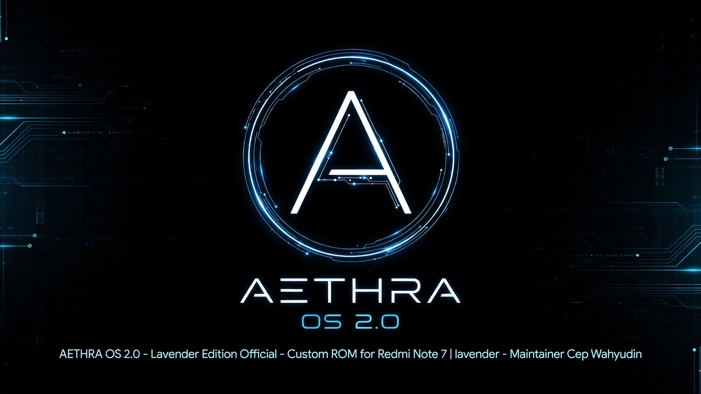

  

# AETHRA OS 2.0 - OFFICIAL
### by Cep Wahyudin (Otodidak07)

-green?style=for-the-badge)

> Custom ROM ringan, stabil, dan resmi untuk Redmi Note 7 - Dibangun dari 0 oleh Otodidak07.

### ✨ Fitur AETHRA OS 2.0
- Base Android 13 Stable
- AETHRA Branding 2.0 Official
- Face Unlock Supported
- Debloated & Optimized
- Official Build by Cep Wahyudin

### 📱 Device Support
- **Redmi Note 7 (lavender)**

### 👨‍💻 Maintainer
- **Cep Wahyudin**
- GitHub: [@Otodidak07](https://github.com/Otodidak07)

### 📥 Source
